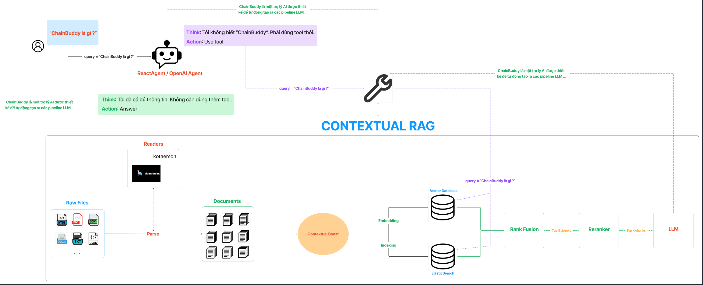

## **Base RAG tool**



### **Table of Contents**

1. [**Installation**](#installation)

2. [**Ingest Data**](#ingest-data-examples)

3. [**Continuous Ingestion**](#continuous-ingestion)

4. [**Run Demo**](#run-demo)

5. [**Example Usage**](#example-usage)

6. [**Start Application**](#start-application)

### **Installation**

To install this application, follow these steps:

**1. Clone the repository:**

```bash
git clone https://github.com/anminhhung/RAG_tool
cd RAG_tool
```

https://github.com/user-attachments/assets/db7136d6-1826-4e27-8a21-b16abbb79eea

**2. (Optional) Create and activate a virtual environment:**

-   For Unix/macOS:

```bash
python3 -m venv venv
source venv/bin/activate
```

-   For Windows:

```bash
python -m venv venv
.\venv\Scripts\activate
```

> Note: Please downgrade to `python3.11` if any conflicts occur.

https://github.com/user-attachments/assets/c4b879b3-4082-456f-854e-364b47d3a4b1

**3. Install the required dependencies:**

```bash
pip install -r requirements.txt
```

https://github.com/user-attachments/assets/79bdb39f-4d7b-49c5-89ec-cbb8bb39b2ad

**4. After activating your environment, run:**

```bash
bash scripts/contextual_rag_additional_installation.sh
```

**(Optional) Verify installation:** You should run this to ensure all packages are installed successfully !

```bash
pip install pytest

pytest tests/
```

https://github.com/user-attachments/assets/26a27bdd-557f-446c-984d-c3bc601e3b25

**5. Run database:**

```bash
docker compose up -d
```

https://github.com/user-attachments/assets/19b65073-ede3-45d3-801b-5788000eb172

**6. Config URL for database**: In [config/config.yaml](./config/config.yaml), please modify urls of QdrantVectorDB and ElasticSearch:

```yml
...
CONTEXTUAL_RAG:
    ...
    QDRANT_URL: <fill here>

    ELASTIC_SEARCH_URL: <fill here>
```

https://github.com/user-attachments/assets/16091cb2-8b33-4ea9-8494-7e34c7e3e427

**7. Setup Agent:** In [config/config.yaml](./config/config.yaml), please select agent type:

```yml
    ...
AGENT:
    TYPE: <fill here> # [openai, react]
```

Currently, we support:

|   TYPE   |     Agent     |
| :------: | :-----------: |
| `openai` | `OpenAIAgent` |
| `react`  | `ReActAgent`  |

https://github.com/user-attachments/assets/5eda47f7-7c35-4fd1-a77d-b53b4db5ec01

**8. Setup API Keys:** Please create `.env` file and provide these API keys:

|         NAME          |                     Where to get ?                      |
| :-------------------: | :-----------------------------------------------------: |
|   `OPENAI_API_KEY`    | [OpenAI Platform](https://platform.openai.com/api-keys) |
| `LLAMA_PARSE_API_KEY` |    [LlamaCloud](https://cloud.llamaindex.ai/api-key)    |
|   `COHERE_API_KEY`    |     [Cohere](https://dashboard.cohere.com/api-keys)     |

https://github.com/user-attachments/assets/b45c9687-278b-4953-9b5b-31fa53db0c8c

---

### **Ingest data (Examples)**

```bash
bash scripts/contextual_rag_ingest.sh both sample/
```

> Note: Please refer to [scripts/contextual_rag_ingest.sh](scripts/contextual_rag_ingest.sh) to change the files dir.

https://github.com/user-attachments/assets/0201d09e-4d17-4372-8680-fbcfb43b908d

### **Continuous Ingestion**

-   You can add more file paths or even folder paths:

```bash
python src/ingest/add_files.py --type both --files a.pdf b.docx docs/ ...
```

---

### **File Readers**

-   You can refer to: [here](./tests/test_loader.py) to see how to use each of them.

| File extension |        Reader        |
| :------------: | :------------------: |
|     `.pdf`     |     `LlamaParse`     |
|    `.docx`     |     `DocxReader`     |
|    `.html`     | `UnstructuredReader` |
|    `.json`     |     `JSONReader`     |
|     `.csv`     |  `PandasCSVReader`   |
|    `.xlsx`     | `PandasExcelReader`  |
|     `.txt`     |     `TxtReader`      |

-   Example usage of `LlamaParse`:

```python
import os
from pathlib import Path
from dotenv import load_dotenv
from llama_index.readers.llama_parse import LlamaParse

load_dotenv()

loader = LlamaParse(result_type="markdown", api_key=os.getenv("LLAMA_PARSE_API_KEY"))

documents = loader.load_data(Path("sample/2409.13588v1.pdf"))

...
```

---

### **Run demo**

-   **1. Contextual RAG**

```bash
python demo/demo_contextual_rag.py --q "Cái gì thất bại đề cử di sản thế giới ?" --compare --debug
```

-   **2. ChatbotAssistant**

```bash
python demo/demo_chatbot_assistant.py --q "ChainBuddy là gì ?"
```

---

### **Example Usage**

-   **1. Contextual RAG**

```python
from src.embedding import RAG
from src.settings import Settings

setting = Settings()

rag = RAG(setting)

q = "Cái gì thất bại đề cử di sản thế giới ?"

print(rag.contextual_rag_search(q))
```

-   **2. ChatbotAssistant**

```python
from api.service import ChatbotAssistant

bot = ChatbotAssistant()

q = "ChainBuddy là gì ?"

print(bot.complete(q))
```

### **Start application**

```bash
# backend
uvicorn app:app --reload

# UI
streamlit run streamlit_ui.py
```
